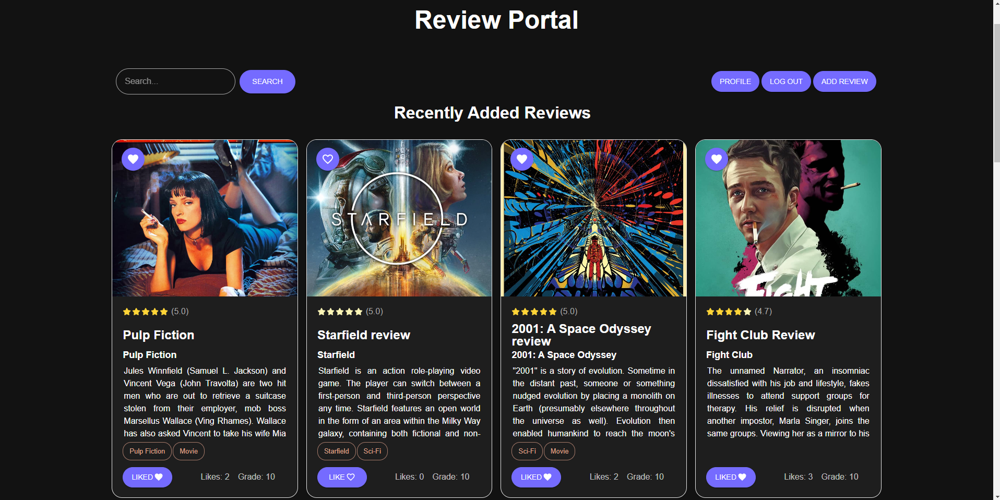

# Review Portal 

Welcome to the Review Portal! This platform is designed to provide a space for users to share reviews of movies, books, and games. With features like personal user pages, full-text search, and social network authentication, it offers a comprehensive experience for both creators and consumers of reviews.

## Features

- **User Authentication**: Users can authenticate via social networks for easy access.
- **Review Creation**: Create detailed reviews with a review name, piece of art name, "group" (e.g., "Movies," "Books"), tags, review text , optional image upload, and a grade from 0 to 10.
- **Review Interaction**: Users can ratings (1 to 5 stars) and "likes" for reviews.
- **Commenting**: Users can leave comments on reviews, creating interactive discussions.
- **Automatic Updates**: Comments and reviews are updated automatically when left by other users.
- **Personal User Pages**: Each user has a personal page with a table of their reviews. The table supports search, sorting, and various actions such as editing or deleting for review management.
- **Full-Text Search**: Perform a full-text search across the entire app, with search results displayed as a list of reviews.
- **Tag Autocompletion**: When adding tags to reviews, users receive autocompletion suggestions for existing tags.
- **Cloud Image Storage**: All images are stored in the cloud, and the upload control supports drag-and-drop functionality.
- **Admin Access**: Admins have access to user pages and reviews as if they were the creators, allowing for review editing and creation on behalf of users.
- **UI Languages**: The app supports English and Georgian as user-selectable UI languages.
- **Themes**: Choose between light and dark themes for the app's appearance.

## Technology Stack

- **Frontend**: ReactJS, Material-UI (mui), react-intl for internationalization
- **Backend**: Node.js, Express.js, SocketIo, MySQL, Sequelize
- **Authentication**: Social network authentication (Google,Github)
- **Cloud Storage**: Cloudinary storage for images

- ## How to Use
1. Open the [Live Demo](https://review-portal-y82o.onrender.com) link.
2. Wait briefly for server connections to establish.
3. Authenticate using your social network account.
4. Interact with the platform:
   - Leave comments on reviews.
   - Rate reviewed pieces (1 to 5 stars).
   - Like reviews.
   - Create your own reviews.
5. Customize your experience by toggling themes (light/dark) and choosing your preferred language (English/Georgian).
Enjoy exploring and sharing reviews on the Art Review Platform!

### Screenshot

## Links

- GitHub Repository: [github.com/abramishvilisaba/review-portal](https://github.com/abramishvilisaba/review-portal)
- Live Demo: [review-portal-y82o.onrender.com](https://review-portal-y82o.onrender.com)

## Author

- GitHub: [abramishvilisaba](https://github.com/abramishvilisaba)

## Contributing

Contributions to this project are welcome! If you find a bug or have suggestions for improvements, please feel free to open an issue or submit a pull request.
